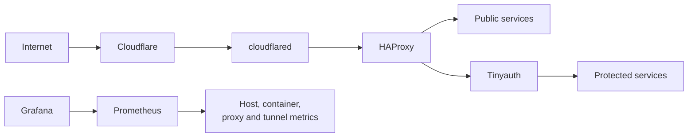

# Christian's Homelab

**[Overview](#overview) | [Features](#features) | [Tech Stack](#tech-stack) | [Get Started](#get-started) | [Operations](#operations)**

[](https://github.com/hyssedev/homelab/actions/workflows/ansible.yml)
[](https://developer.mend.io/github/hyssedev/homelab)
[](LICENSE)
[](https://www.ansible.com/)
[](https://docs.docker.com/compose/)

Infrastructure as Code for taking a fresh Debian VPS from its initial SSH login
to a hardened, monitored, and internet-accessible homelab.

## Overview

The host is provisioned with Ansible and runs each application as an independent
Docker Compose project. Cloudflare Tunnel provides an outbound-only public entry
path, HAProxy handles internal routing and policy, and Tinyauth protects private
applications. Prometheus and Grafana provide host and container observability.



No application ports are published publicly on the host. HAProxy communicates
with `cloudflared` over a private Docker network, while statistics and metrics
are bound only to loopback or internal monitoring networks.

## Features

- [x] Reproducible provisioning from a fresh Debian VPS
- [x] SSH hardening, UFW, fail2ban, and unattended upgrades
- [x] Rootless public ingress through Cloudflare Tunnel
- [x] Central routing and security policy with HAProxy
- [x] Forward authentication for private applications
- [x] Isolated Docker Compose projects and shared networks
- [x] Vault-encrypted deployment secrets
- [x] Host and per-container metrics with 30-day retention
- [x] Automatically provisioned Grafana data source and dashboards
- [x] Pull request validation for Ansible and Docker Compose
- [x] Daily dependency updates with review through Renovate
- [x] Persistent application data excluded from deployments and Git

## Tech Stack

<table>
  <tr>
    <th>Logo</th>
    <th>Technology</th>
    <th>Purpose</th>
  </tr>
  <tr>
    <td></td>
    <td><a href="https://www.ansible.com/">Ansible</a></td>
    <td>Provisioning, hardening, secrets, and deployments</td>
  </tr>
  <tr>
    <td></td>
    <td><a href="https://www.debian.org/">Debian</a></td>
    <td>VPS operating system</td>
  </tr>
  <tr>
    <td></td>
    <td><a href="https://www.docker.com/">Docker Compose</a></td>
    <td>Independent application stacks</td>
  </tr>
  <tr>
    <td></td>
    <td><a href="https://developers.cloudflare.com/cloudflare-one/connections/connect-networks/">Cloudflare Tunnel</a></td>
    <td>Outbound-only public ingress</td>
  </tr>
  <tr>
    <td></td>
    <td><a href="https://www.haproxy.org/">HAProxy</a></td>
    <td>Routing, authentication policy, and health checks</td>
  </tr>
  <tr>
    <td></td>
    <td><a href="https://grafana.com/">Grafana</a></td>
    <td>Dashboards and observability interface</td>
  </tr>
  <tr>
    <td></td>
    <td><a href="https://prometheus.io/">Prometheus</a></td>
    <td>Metrics collection and time-series storage</td>
  </tr>
  <tr>
    <td></td>
    <td><a href="https://docs.renovatebot.com/">Renovate</a></td>
    <td>Reviewed dependency and container image updates</td>
  </tr>
</table>

## Applications

| Application | Purpose | Access |
| --- | --- | --- |
| `chrs.ro` | Landing page | Public |
| Kener | Status page and uptime monitoring | Public |
| Tinyauth | Authentication portal | Public login |
| Dynacat | Homelab dashboard | Protected |
| Dockhand | Docker management | Protected |
| Grafana | Monitoring dashboards | Protected |
| Prometheus | Metrics storage | Internal |
| node_exporter | Host metrics | Internal |
| cAdvisor | Container metrics | Internal |

## Get Started

Requirements are a fresh Debian VPS, Python 3 with pip, an SSH key, an Ansible
Vault password, and a configured Cloudflare Tunnel.

Run from `ansible/`:

```sh
python3 -m pip install -r requirements.txt
ansible-galaxy collection install -r requirements.yml
cp inventory/hosts.example.yml inventory/hosts.yml
```

Review `inventory/hosts.yml` and `inventory/group_vars/all.yml`, then provision
the host:

```sh
export ANSIBLE_VAULT_PASSWORD_FILE=../.vault_pass
ansible-playbook playbooks/provision.yml
```

Change the inventory from SSH port `22` to the configured hardened port, then
deploy all services:

```sh
ansible-playbook playbooks/apps.yml
```

`provision.yml` runs bootstrap, hardening, and Docker installation in order.
`apps.yml` validates secrets, synchronizes stack definitions, preserves runtime
data, creates shared networks, and reconciles every Compose project.

## Operations

### Monitoring

Prometheus retains up to 30 days or 5 GB. Grafana automatically provisions its
Prometheus data source and four pinned community dashboards:

| Dashboard | ID | Revision |
| --- | ---: | ---: |
| HAProxy | 12693 | 14 |
| Node Exporter Full | 1860 | 45 |
| cAdvisor exporter | 14282 | 1 |
| Cloudflare Tunnels | 17457 | 6 |

### Persistence

Persistent paths under `/opt/stacks` include Tinyauth sessions, Dockhand state,
Kener data, Grafana state, and the Prometheus TSDB. They are excluded from Git
and rsync source updates. Back them up when preserving state or history matters.

### Automation

GitHub Actions runs `ansible-lint` and `docker compose config --quiet` on
relevant pull requests and pushes to `main`. Jobs use read-only permissions,
timeouts, dependency caches, and no deployment credentials.

Renovate checks daily before 06:00 in `Europe/Bucharest` and opens reviewable
pull requests for GitHub Actions, Python tooling, Ansible Galaxy collections,
and Compose images. Updates are never merged automatically.

### Adding A Service

1. Create a Compose project under `stacks/`.
2. Attach web applications to the external `reverse-proxy` network.
3. Add the project to `stacks` in `ansible/inventory/group_vars/all.yml`.
4. Add its hostname, ACL, backend, and health check to HAProxy.
5. Add the hostname to HAProxy's `protected` ACL when authentication is needed.

## License

Copyright (C) 2026 Cristian-Ionut Sauciuc.

Distributed under the GNU General Public License v3.0. See [`LICENSE`](LICENSE)
for details.

Vendored HAProxy Lua dependencies and their upstream revisions are documented
separately in [`stacks/haproxy/config/lua/README.md`](stacks/haproxy/config/lua/README.md).
