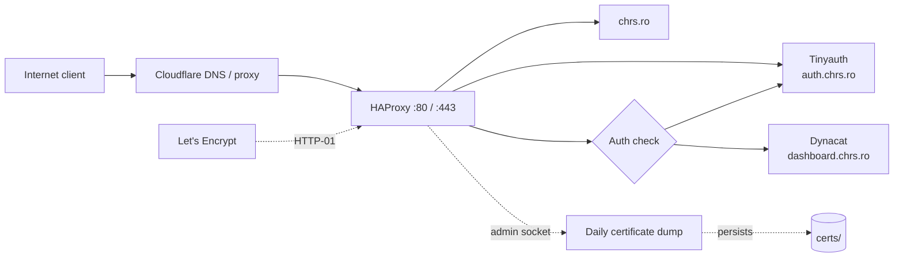

# Homelab Ansible

Provider-agnostic Ansible automation for provisioning a Debian VPS and running
internet-facing homelab services with Docker Compose, HAProxy, automatic TLS,
and Tinyauth forward authentication.

## Architecture



HAProxy is the only public application entry point. Services communicate over
the external `reverse-proxy` Docker network and do not publish application
ports directly. The landing page is public; the dashboard requires a Tinyauth
session.

| Component | Purpose |
| --- | --- |
| Ansible | Bootstraps, hardens, and configures the VPS |
| Docker Compose | Runs each service as an independent stack |
| HAProxy | TLS termination, routing, security policy, and health checks |
| Tinyauth | Login UI and forward authentication for protected services |
| Let's Encrypt | Native HAProxy ACME certificates using HTTP-01 |

## Repository Layout

```text
ansible/
  inventory/            Host inventory and shared variables
  playbooks/            Bootstrap, hardening, Docker, and app deployment
stacks/
  haproxy/              Edge proxy, native ACME, Lua auth integration
  tinyauth/             Authentication service and persistent session data
  chrs.ro/              Public landing page
  dynacat/              Protected dashboard
```

## Recreate A VPS

Requirements:

- A fresh Debian VPS reachable as `root` over SSH
- Ansible installed locally
- An SSH key pair and the Ansible Vault password
- DNS records for `chrs.ro`, `www`, `dashboard`, and `auth` pointing to the VPS

Run commands from `ansible/`.

1. Install the required Ansible collections:

   ```sh
   ansible-galaxy collection install -r requirements.yml
   ```

2. Create the ignored inventory and update the host address. Use the VPS's
   initial SSH port, normally `22`:

   ```sh
   cp inventory/hosts.example.yml inventory/hosts.yml
   ```

3. Review `inventory/group_vars/all.yml`, especially `admin_user`, `ssh_port`,
   and the local SSH key paths. Configure vault access either interactively
   with `--ask-vault-pass` or through the ignored password file:

   ```sh
   export ANSIBLE_VAULT_PASSWORD_FILE=../.vault_pass
   ```

4. Bootstrap the SSH key and administrative user, then harden the host:

   ```sh
   ansible-playbook playbooks/bootstrap.yml
   ansible-playbook playbooks/harden.yml
   ```

5. Change `ansible_port` in `inventory/hosts.yml` to the hardened `ssh_port`,
   then install Docker and deploy the stacks:

   ```sh
   ansible-playbook playbooks/docker.yml
   ansible-playbook playbooks/apps.yml
   ```

The app playbook copies stacks to `/opt/stacks`, creates the shared Docker
network, writes runtime secrets, starts HAProxy last, and installs the daily
certificate persistence cron job.

## Authentication

Generate a Tinyauth `username:bcrypt-hash` record:

```sh
docker run --rm -it ghcr.io/tinyauthapp/tinyauth:v5.1.3 user create --interactive
```

Encrypt the complete record instead of committing the bcrypt hash directly:

```sh
ansible-vault encrypt_string --ask-vault-pass --stdin-name tinyauth_users
```

Store the resulting `!vault` block in
`ansible/inventory/group_vars/all.yml`. During deployment, Ansible writes the
decrypted value to `/opt/stacks/tinyauth/secrets/users` with mode `0600`.

## TLS And Persistence

HAProxy obtains the certificate declared in `haproxy.cfg` directly from Let's
Encrypt. HTTP-01 challenges are served on port 80 before the HTTP-to-HTTPS
redirect. Renewed certificates live in HAProxy memory, so a root cron job runs
the official [`haproxy-dump-certs`](https://github.com/haproxy/haproxy/blob/master/admin/cli/haproxy-dump-certs)
script daily and writes them to the bind-mounted `stacks/haproxy/certs/`
directory.

Runtime state is intentionally excluded from Git:

| Path on the VPS | Contents | Recovery behavior |
| --- | --- | --- |
| `/opt/stacks/haproxy/certs/` | Certificate, private key, ACME account key | Reissued on a fresh VPS if not restored |
| `/opt/stacks/tinyauth/data/` | SQLite sessions and future OIDC state | Existing sessions are lost if not restored |
| `/opt/stacks/tinyauth/secrets/users` | Decrypted Tinyauth user record | Recreated from Ansible Vault |

For disaster recovery, the repository, vault password, and SSH private key are
sufficient to rebuild the host. Back up the ignored HAProxy and Tinyauth data
directories only when preserving the ACME account or active sessions matters.

## Adding A Service

Create a Compose stack under `stacks/`, attach it to the external
`reverse-proxy` network, add it to `stacks` in `ansible/playbooks/apps.yml`, and
define its hostname, certificate SAN, ACL, backend, and health check in
`stacks/haproxy/config/haproxy.cfg`. Add the hostname to the `protected` ACL
when it should require Tinyauth.

Vendored HAProxy Lua dependencies and their pinned upstream revisions are
documented in [`stacks/haproxy/config/lua/README.md`](stacks/haproxy/config/lua/README.md).
